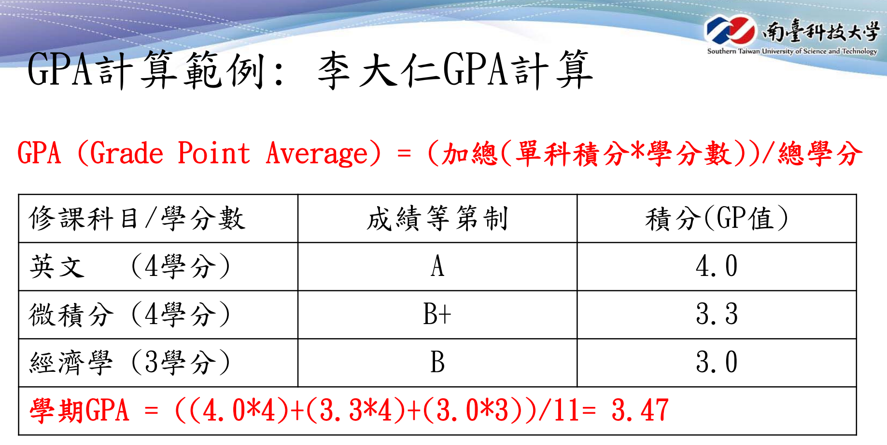
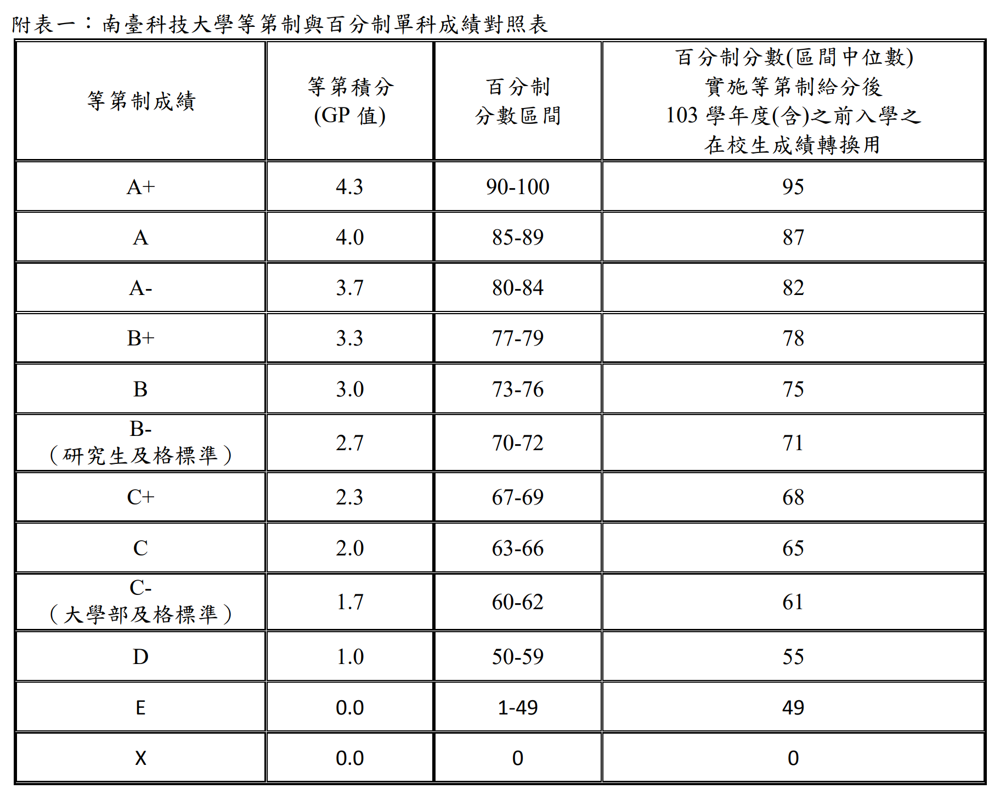

# 計算機程式及實習 (2022 Spring) 期末測驗

### <a href="https://sndn.link/cprog2022s/fgR0wf" target="_blank">[Podcast 說明] : https://sndn.link/cprog2022s/fgR0wf</a>

### [問題 5]：南臺科技大學『等第制』成績輸出及GPA計算

- 輸入資料格式：
    - 單科資料：成績 學分
    - 要能處理多筆單科資料輸入
- 輸入資料範例：
```powershell
88 4 78 4 75 3
```
- 對應的輸出結果：
```powershell
A  4 B+  4  B  3 3.47
```
#### 使用以下方式輸出GPA
```c++
cout<<setw(5)<<fixed<<setprecision(2)<<gpa<<endl;
```

#### GPA 計算範例


#### 南臺科技大學等第制與百分制單科成績對照表


### 簡易測試
```powershell
prob05> g++ -o main .\main.cpp     
prob05> 88,4,78,4,75,3 | .\main.exe
  A  4 B+  4  B  3 3.47

prob05> 90,3,90,4,50,4 | .\main.exe     
 A+  3 A+  4  D  4 3.10

prob05> 60,1,90,4,88,2,79,1 | .\main.exe
 C-  1 A+  4  A  2 B+  1 3.78
```

### 隨機自動檢測
```powershell
prob05> .\test.ps1
g++ -o main ./main.cpp

********************************************
*       Introduction to Programming        *
*  Exercises / Homework Automatic Grading  *
********************************************

Test Data : 96 2 72 1
Test Data : 67 1
Test Data : 47 2 91 4 48 3 41 1
Test Data : 92 1
Test Data : 100 1
Test Data : 50 1 45 4 96 2 41 2 91 2
Test Data : 77 3 81 4 87 3 40 4 57 4
Test Data : 83 4 85 3 93 1
Test Data : 52 4 71 1 82 3 45 2 64 1
Test Data : 45 2 78 3 97 1 87 3 56 3

測試通過!

  E  2 B+  3 A+  1  A  3  D  3 2.43
```